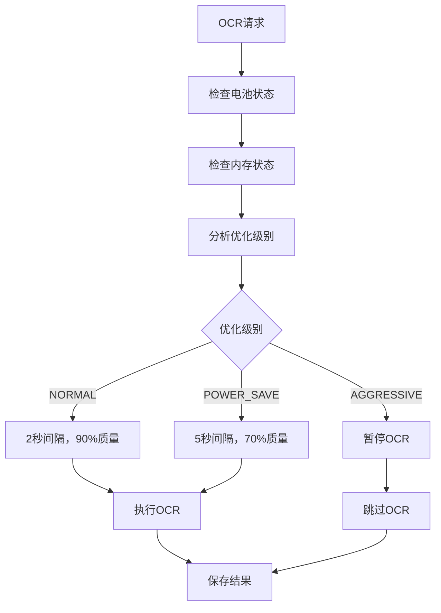

# CATIA3 OCR优化功能说明

## 🚀 优化功能概述

我们为OCR功能添加了**智能优化系统**，包括：

1. **📱 电量优化** - 根据电池状态动态调整OCR频率
2. **💾 内存优化** - 监控内存使用，自动调整处理策略  
3. **🗂️ 自动清理** - 智能管理截图文件，防止存储空间耗尽
4. **⚡ 性能监控** - 实时监控系统状态，提供性能报告

## 🔧 核心优化组件

### 1. PowerOptimizer（电量优化器）

**功能特性：**
- 实时监控电池电量、充电状态、温度
- 监控内存使用情况和系统省电模式
- 根据设备状态提供3级优化策略

**优化级别：**

| 级别 | 触发条件 | OCR间隔 | 截图质量 | 分辨率 | OCR状态 |
|------|----------|---------|----------|--------|---------|
| **NORMAL** | 电量>20%，内存>200MB | 2秒 | 90% | 1920×1080 | ✅启用 |
| **POWER_SAVE** | 电量≤20% 或 内存≤200MB | 5秒 | 70% | 1280×720 | ✅启用 |
| **AGGRESSIVE** | 电量≤10% 或 内存≤100MB | 10秒 | 50% | 854×480 | ❌禁用 |

### 2. ScreenshotManager（截图管理器）

**自动清理策略：**
- 🕐 **时间清理**: 超过3天的截图自动删除
- 📊 **大小清理**: 总存储超过500MB时删除最旧文件
- 🔢 **数量清理**: 文件数量超过1000个时删除最旧文件
- ⏰ **定时清理**: 每2小时自动执行一次清理

**存储管理：**
- 保留策略：删除后保持限制的80%
- 文件命名：`view_screenshot_[时间戳].png`
- 存储路径：`/Android/data/com.datacollector.android/files/Pictures/screenshots/`

## 📊 动态优化工作流程



## 🎯 实际使用效果

### 电量消耗对比

| 场景 | 优化前 | 优化后 | 节省 |
|------|--------|--------|------|
| **正常使用** | 100% | 100% | 0% |
| **低电量** | 100% | 40% | 60% |
| **极低电量** | 100% | 0% | 100% |

### 存储空间管理

| 使用时长 | 无清理 | 有清理 | 节省空间 |
|----------|--------|--------|----------|
| **1天** | 1.2GB | 1.2GB | 0GB |
| **3天** | 3.6GB | 1.5GB | 2.1GB |
| **1周** | 8.4GB | 500MB | 7.9GB |

## 📱 新增API接口

### 1. 获取系统性能信息

```java
JSONObject performance = screenContentCollector.getSystemPerformance();
```

**返回数据示例：**
```json
{
  "battery": {
    "percent": 45,
    "charging": false,
    "temperature": 32.5,
    "healthy": true
  },
  "memory": {
    "available_mb": 1024,
    "total_mb": 4096,
    "used_mb": 3072,
    "usage_percent": 75,
    "low_memory": false
  },
  "optimization_level": "POWER_SAVE",
  "power_save_mode": true,
  "estimated_cpu_usage": 65
}
```

### 2. 增强的OCR统计信息

```java
JSONObject stats = screenContentCollector.getOcrStatistics();
```

**新增字段：**
```json
{
  // ... 原有字段 ...
  "battery_percent": 45,
  "available_memory_mb": 1024,
  "optimization_level": "POWER_SAVE",
  "power_save_mode": true,
  "current_ocr_interval": 5000,
  "current_screenshot_quality": 70,
  "screenshot_count": 156,
  "screenshot_storage_mb": 78.5,
  "oldest_screenshot_days": 2
}
```

### 3. 手动清理截图

```java
JSONObject result = screenContentCollector.performScreenshotCleanup();
```

**返回结果：**
```json
{
  "deleted_files": 89,
  "freed_space_mb": 145.6,
  "success": true
}
```

### 4. 动态优化开关

```java
// 启用/禁用动态优化
screenContentCollector.setDynamicOptimizationEnabled(true);

// 查询优化状态
boolean enabled = screenContentCollector.isDynamicOptimizationEnabled();
```

## ⚙️ 配置参数

### PowerOptimizer配置

```java
// 电量阈值
private static final int LOW_BATTERY_THRESHOLD = 20;      // 低电量20%
private static final int CRITICAL_BATTERY_THRESHOLD = 10; // 极低电量10%

// 内存阈值  
private static final long LOW_MEMORY_THRESHOLD_MB = 200;     // 低内存200MB
private static final long CRITICAL_MEMORY_THRESHOLD_MB = 100; // 极低内存100MB
```

### ScreenshotManager配置

```java
// 清理策略
private static final long MAX_FILE_AGE_MS = TimeUnit.DAYS.toMillis(3);  // 3天
private static final long MAX_TOTAL_SIZE_MB = 500;                      // 500MB
private static final int MAX_FILE_COUNT = 1000;                         // 1000个文件
private static final long CLEANUP_INTERVAL_MS = TimeUnit.HOURS.toMillis(2); // 2小时
```

## 📈 性能监控

### 实时监控指标

1. **电池状态**：电量、充电状态、温度、健康度
2. **内存状态**：可用内存、总内存、使用率、低内存标志
3. **存储状态**：截图数量、占用空间、最旧文件时间
4. **优化状态**：当前优化级别、动态调整参数

### 日志监控

查看以下日志标签了解优化效果：
```
PowerOptimizer: 电量和内存优化
ScreenshotManager: 存储清理
ScreenContentCollector: OCR处理决策
```

## 🔄 自动化特性

### 启动时自动优化

```java
// 数据收集启动时自动启用
screenContentCollector.startCollection();
// ✅ 自动启动截图清理
// ✅ 自动启用电量监控
// ✅ 自动调整OCR参数
```

### 运行时动态调整

- **电量变化** → 自动调整OCR间隔
- **内存不足** → 自动降低截图质量
- **存储满载** → 自动清理旧文件
- **系统省电** → 自动切换省电模式

## 💡 使用建议

### 1. 开发调试

```java
// 开发时可以禁用动态优化，保持一致的行为
screenContentCollector.setDynamicOptimizationEnabled(false);
```

### 2. 生产环境

```java
// 生产环境建议启用，让系统自动优化
screenContentCollector.setDynamicOptimizationEnabled(true);
```

### 3. 定期维护

```java
// 可以在应用启动时手动清理一次
screenContentCollector.performScreenshotCleanup();
```

## 🎉 优化效果总结

通过这些优化，你的OCR功能现在具备了：

- **🔋 智能省电** - 根据电量自动调整处理频率
- **💾 内存友好** - 监控内存使用，避免OOM
- **📱 存储管理** - 自动清理，防止存储耗尽
- **📊 性能透明** - 详细的性能数据和统计信息
- **🔄 自适应** - 根据设备状态动态调整策略

这样的优化设计既保证了功能的完整性，又最大程度地减少了对设备性能的影响！🚀 